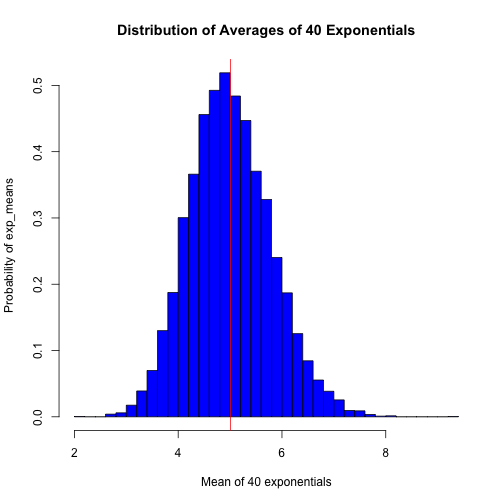

#Overview
The purpose of this report is to compare the **Exponential Distribution** to the **Central Limit Theorem**. Using a Simulation, it will be shown that the distribution of averages of n number of random exponential variables becomes that of an standard nomral as n sample size increases. This is exactly what the Central Limit Theorem states.

#Simulations
To study the exponential distribution, let's first compare the distribution of **10000** random exponentials with the distribution of 40 averages of random exponentials:


```r
set.seed(5)
lambda = 0.2
n = 10000
y <- rexp(n, rate = lambda)
hist(y,ylab="prob(y)",col="blue",breaks=50,main="Exponential Distribution")
```

 

```r
mean_y <- round(mean(y),2)
mean_y
```

```
## [1] 5.02
```

```r
sd_y <- round(sd(y),2)
sd_y 
```

```
## [1] 5.05
```

So, it is known that the teorethical mean of the exponential distribution is equal to 1/lambda: 

- In this example, lambda = 0.2, so **1/lambda = 5**
- As it is shown in the previous R chunk, the mean of these **10<sup>4</sup>** exponentials is **5.02**

Also, the teorethical standard deviation of the exponential distribution is equal to 1/lambda:

- As it is shown in the previous R chunk, the standard deviation of these **10<sup>4</sup>** exponentials is **5.05**

Now let's simulate the random distribution resulted from the calculation of **10<sup>4</sup>** averages of 40 exponentials:


```r
exp_means = NULL

for(i in 1 : n) exp_means = c(exp_means,mean(rexp(40, rate = lambda)))
sample_mean = round(mean(exp_means),2)
sample_mean
```

```
## [1] 5.01
```

```r
hist(exp_means,xlab="Mean of 40 exponentials",ylab="Probability of exp_means",col="blue",breaks=50,main="Distribution of Averages of 40 Exponentials")
abline(v=sample_mean,col="red")
```

 

```r
# a red line is added to the histogram at the value of the sample_mean
```

##Sample Mean vs Theoretical Mean in the Exponential Distribution
So, as it is shown in the previous R code chunck:

- The sample mean (the mean of the vector of averages of 40 exponentials) is equal to **5.01**
- The teorethical mean of the Exponential Distribution is 1/lambda, for lambda = 0.2, the theoretical mean is equal to **5**
- Also, in the R code chuck "exp_dist" it is shown that the mean of **10<sup>4</sup>** exponentials is **5.02**
        
##Sample Variance vs Theoretical
The theoretical variance of the Sample is equal to **$\frac{\sigma^2}{n}$**. In the **Exponential Distribution** **$\sigma = \frac{1}{\lambda}$**, so we have that the **theoretical variance of the sample is:**

$$var(sample) = \frac{\frac{1}{\lambda}^2}{n} = \frac{1}{n\lambda^2} = \frac{1}{40*0.2^2} = 0.625$$

Now, we can also calculate the variance of the variable **exp_means** that is the vector of means of 40 exponentials that we simulated in the R code chuck **"exp_dist_simulation"**:


```r
var_exp_means = round(var(exp_means),4)
var_exp_means
```

```
## [1] 0.6196
```

So, as shown in the previous R code chunk, the variance of the means of 40 exponentials is equal to **0.6196**, that is pretty close to the theoretical variance that we got of **0.625**.

