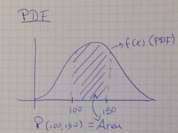
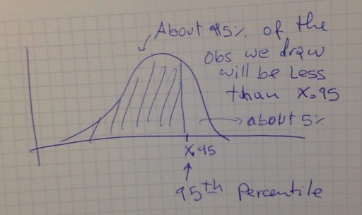
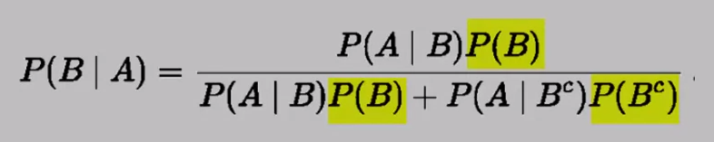
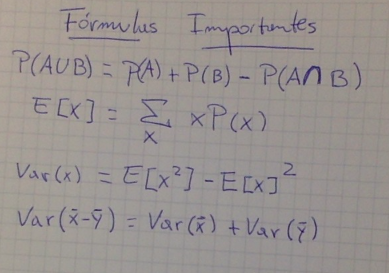

```{r set_options}
require(knitr)
opts_chunk$set(echo=TRUE)
```

#Abstract
My notes of the Statistical Inference at coursera's Data Science Specialization.

#Statistical Inference
Statistical Inference is the process of generating conclusions about a population from a noisy sample.

#Week 1

#Lecture 1: Probability
Given a random experiment (say, rolling a dice) is a population quantity that summarize the randomness.

##Rules of Probability

- Specifically, probability takes a possible outcome from the experiment and:
        - assigns it a number between 0 and 1
        - so that the probability that something occurs is 1 (the dice must be rolled) and
        - so the probability of the union of any two sets of outcomes that have nothing in common (mutually exclusive), is the sum of their respective probabilities.
        
###Example:
If A and B cannot both occur:
P(A U B) = P(A) + P(B)

###Consecuences of the Rules of Probability

- The probability that nothing occurs is 0
- The probability that something occurs is 1
- The probability of something is 1 minus the probability that the opposite occurs
- The probability of at least one of two things (or more) that cannot occurs at the same time (that are mutually exclusive) is the sum of their respective probabilities
- If an event A implies the occurrence of event B, then the probability of A occurring is less that the probability of B occurs

- For any two events the probability that at least one occurs is the sum of their probabilities minus their intersection


#Lecture 2: Probability of Mass Functions
**A random variable is a numerical outcome of an experiment.
A random variable can be:

- **Discrete:** like integer numbers, colors, classes, etc. We work with discrete random variable by assigning a probability that a value occurs.
- **Continuons:** coninous numbers (float). We work with continuous random variable by assigning a probability that a range of values occurs.

##PMF (Probability Mass Function)
A **PMF** is the function that returns the probability that a random discrete variable occurs.

1) It must always by igual or higher than 0
2) The sum of the probability off all possible random variables outcomes is equal to 1

###Example of a PMF
Flip of a coin
X = 0 represents tails and X = 1 represents heads:

        p(x) = (1/2)^x (1/2)^(1-x) for x = 0,1 =>
        p(0) = (1/2)^0 (1/2)^1 = 1/2
        p(1) = (1/2)^1 (1/2)^0 = 1/2
        
But, this is a fair coin. For an unfair coin:

        p(x) = D^x (1 - D)^(1-x) for x= 0,1 =>
        p(0) = D^0 (1 - D)^(1 - 0) = (1 - D)
        p(1) = D^1 (1 - D)^(1 - 1) = D
So, when the coin is fair, D = 0.5 (1/2)

#Lecture 3: Probability Density Functions (PDF)
**PDF** is a function associated to continouns random variable. It must comply with the following rules:

1) It must be larger or equal to zero everywhere
2) The total area under it must be equal to one



##Example of a PDF

```{r pdf_example}
x <- c(-0.5, 0, 1, 1, 1.5)
y <- c(0,0,2,0,0)
plot(x, y, lwd=3, frame=FALSE, type="l")

# This is actually the Beta Probability Density Function. In R we have the function pbeta(p, p1, p2)
# What is the probability that 75% of this population gets draw
pbeta(0.75,2,1) # 2 and 1 are the height and the base of the triangle
# so the probability is 56.25%
```
We can see that this can be a PDF. The Area below the plot is equal to one (b x h)/2 = 1x2.0/2 = 1

##CDF and survival function
The **CDF (Cummulative Distribution Function)** of a random variable, X, returns the probability that the random variable is less than or equal to x:
        
        F(x) = P(X <= x)
        
The **Survival function** of a random variable X is defined as the probability that the random variable is greater than x:
        
        S(x) = P(X > x)

So, notice that:
        
        S(x) = 1 - F(x)

##Example

        F(x) = P(X <= x) = 1/2(Base x Height) = 1/2 x (2x) = x^2
        
        Then S(x) = 1 - x^2
        
##Quantile

The alpha-th quantile of a distribution with a CDF F is the point x-alpha so that:

        F(x-alpha) = alpha
        
- A **percentile** is simply a quantile with the alpha expressed as a percent
- The **median** is the 50th percentile



#Lecture 4: Conditional Probability

Given the Probability of A when B occurs, the conditional probability of A is:

        P(A|B) = P(A interception B) / P(B)
        
If A are B are unrelated, then P(A|B) = P(A)

#Lecture 5: Baye's Rule



#Lecture 6: Indepence

Event A is independence of event B if:

        P(A|B) = P(A) where P(B) > 0
        
also
        P(A inter B) = P(A) x P(B)
        
So, you cannot multiply probabilities unless you know the events are independent.

##IID random variables

Random variables are said to be IID (Idependent and Identically Distributed):

- Independent: statistically unrelated from one and another
- Identically Distributed: all having been drawn from the same population distribution

#Lecture 7: Expected Values

**Expected Values** are values that characterized a population.

- The **mean** is a characterization of the center of the population
- The **variance** and **standard deviation** are characterization of how spread out it is

Our sample expected values (the sample mean and variance) will estimate the population versions

        E[X] = Sum_x (x p(x))
        
        E[X] is the center of mass of a collection of locations and weights {x, p(x)}
        
##Example

Suppose that a die is rolled and X is the number faced up. What is the **Expected Value** of X?

        E[X] = 1x1/6 + 2x1/6 + 3x1/6 + 4x1/6 + 5x1/6 + 6x1/6 = 3.5
        
##Distribution of average of a population

- The average of a random variable is a random variable itself and it also has a distribution
- The distribution of averages of a population is centered in the same point as the center of the distribution of the population

##Sumarizing

- Expected values are properties of the distribution (mean, variance, standard deviation)
- The population mean is the center of mass of the population
- The sample mean is the center of mass of the observated data
- The sample mean is an estimate of the population mean
- The sample mean is unbiased:
        - The population mean of its distribution is the mean that it is trying to estimate
- The more data that goes into the sample mean, the more concentrated its density/mass function is around the population mean

#Formulas Summary



