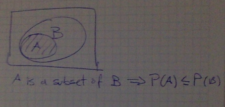
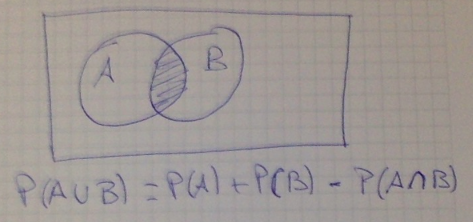

```r
require(knitr)
opts_chunk$set(echo=TRUE)
```

#Abstract
My notes of the Statistical Inference at coursera's Data Science Specialization.

#Statistical Inference
Statistical Inference is the process of generating conclusions about a population from a noisy sample.

#Probability
Given a random experiment (say, rolling a dice) is a population quantity that summarize the randomness.

##Rules of Probability

- Specifically, probability takes a possible outcome from the experiment and:
        - assigns it a number between 0 and 1
        - so that the probability that something occurs is 1 (the dice must be rolled) and
        - so the probability of the union of any two sets of outcomes that have nothing in common (mutually exclusive), is the sum of their respective probabilities.
        
###Example:
If A and B cannot both occur:
P(A U B) = P(A) + P(B)

###Consecuences of the Rules of Probability

- The probability that nothing occurs is 0
- The probability that something occurs is 1
- The probability of something is 1 minus the probability that the opposite occurs
- The probability of at least one of two things (or more) that cannot occurs at the same time (that are mutually exclusive) is the sum of their respective probabilities
- If an event A implies the occurrence of event B, then the probability of A occurring is less that the probability of B occurs

- For any two events the probability that at least one occurs is the sum of their probabilities minus their intersection

