```r
require(knitr)
opts_chunk$set(echo=TRUE)
```

#Abstract
My notes of the Statistical Inference at coursera's Data Science Specialization.

#Statistical Inference
Statistical Inference is the process of generating conclusions about a population from a noisy sample.

#Week 1

#Lecture 1: Probability
Given a random experiment (say, rolling a dice) is a population quantity that summarize the randomness.

##Rules of Probability

- Specifically, probability takes a possible outcome from the experiment and:
        - assigns it a number between 0 and 1
        - so that the probability that something occurs is 1 (the dice must be rolled) and
        - so the probability of the union of any two sets of outcomes that have nothing in common (mutually exclusive), is the sum of their respective probabilities.
        
###Example:
If A and B cannot both occur:
P(A U B) = P(A) + P(B)

###Consecuences of the Rules of Probability

- The probability that nothing occurs is 0
- The probability that something occurs is 1
- The probability of something is 1 minus the probability that the opposite occurs
- The probability of at least one of two things (or more) that cannot occurs at the same time (that are mutually exclusive) is the sum of their respective probabilities
- If an event A implies the occurrence of event B, then the probability of A occurring is less that the probability of B occurs

- For any two events the probability that at least one occurs is the sum of their probabilities minus their intersection


#Lecture 2: Probability of Mass Functions
**A random variable is a numerical outcome of an experiment.
A random variable can be:

- **Discrete:** like integer numbers, colors, classes, etc. We work with discrete random variable by assigning a probability that a value occurs.
- **Continuons:** coninous numbers (float). We work with continuous random variable by assigning a probability that a range of values occurs.

##PMF (Probability Mass Function)
A **PMF** is the function that returns the probability that a random discrete variable occurs.

1) It must always by igual or higher than 0
2) The sum of the probability off all possible random variables outcomes is equal to 1

###Example of a PMF
Flip of a coin
X = 0 represents tails and X = 1 represents heads:

        p(x) = (1/2)^x (1/2)^(1-x) for x = 0,1 =>
        p(0) = (1/2)^0 (1/2)^1 = 1/2
        p(1) = (1/2)^1 (1/2)^0 = 1/2
        
But, this is a fair coin. For an unfair coin:

        p(x) = D^x (1 - D)^(1-x) for x= 0,1 =>
        p(0) = D^0 (1 - D)^(1 - 0) = (1 - D)
        p(1) = D^1 (1 - D)^(1 - 1) = D
So, when the coin is fair, D = 0.5 (1/2)

#Lecture 3: Probability Density Functions (PDF)
**PDF** is a function associated to continouns random variable. It must comply with the following rules:

1) It must be larger or equal to zero everywhere
2) The total area under it must be equal to one

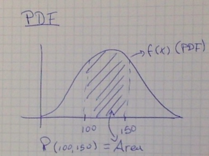

##Example of a PDF


```r
x <- c(-0.5, 0, 1, 1, 1.5)
y <- c(0,0,2,0,0)
plot(x, y, lwd=3, frame=FALSE, type="l")
```

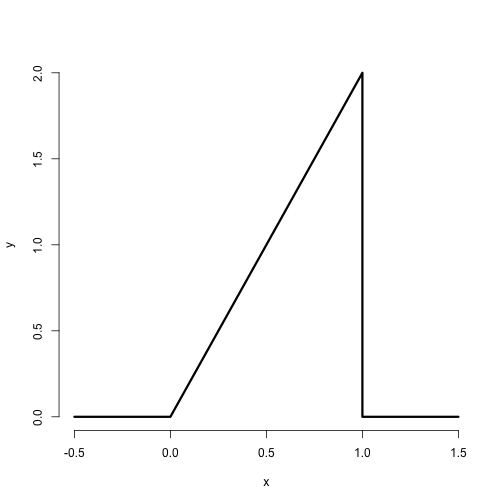 

```r
# This is actually the Beta Probability Density Function. In R we have the function pbeta(p, p1, p2)
# What is the probability that 75% of this population gets draw
pbeta(0.75,2,1) # 2 and 1 are the height and the base of the triangle
```

```
## [1] 0.5625
```

```r
# so the probability is 56.25%
```
We can see that this can be a PDF. The Area below the plot is equal to one (b x h)/2 = 1x2.0/2 = 1

##CDF and survival function
The **CDF (Cummulative Distribution Function)** of a random variable, X, returns the probability that the random variable is less than or equal to x:
        
        F(x) = P(X <= x)
        
The **Survival function** of a random variable X is defined as the probability that the random variable is greater than x:
        
        S(x) = P(X > x)

So, notice that:
        
        S(x) = 1 - F(x)

##Example

        F(x) = P(X <= x) = 1/2(Base x Height) = 1/2 x (2x) = x^2
        
        Then S(x) = 1 - x^2
        
##Quantile

The alpha-th quantile of a distribution with a CDF F is the point x-alpha so that:

        F(x-alpha) = alpha
        
- A **percentile** is simply a quantile with the alpha expressed as a percent
- The **median** is the 50th percentile

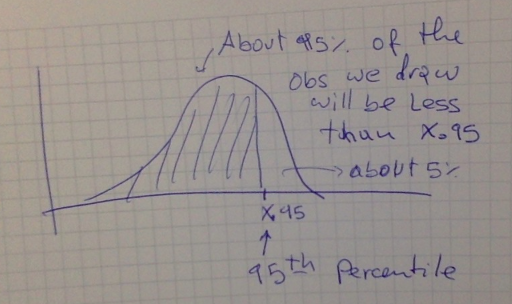

#Lecture 4: Conditional Probability

Given the Probability of A when B occurs, the conditional probability of A is:

        P(A|B) = P(A interception B) / P(B)
        
If A are B are unrelated, then P(A|B) = P(A)

#Lecture 5: Baye's Rule

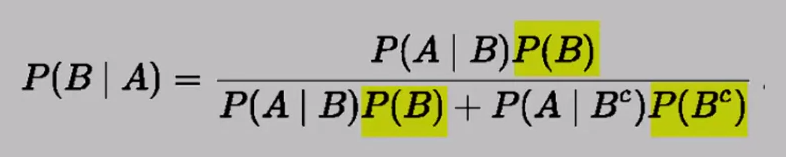

#Lecture 6: Indepence

Event A is independence of event B if:

        P(A|B) = P(A) where P(B) > 0
        
also
        P(A inter B) = P(A) x P(B)
        
So, you cannot multiply probabilities unless you know the events are independent.

##IID random variables

Random variables are said to be IID (Idependent and Identically Distributed):

- Independent: statistically unrelated from one and another
- Identically Distributed: all having been drawn from the same population distribution

#Lecture 7: Expected Values

**Expected Values** are values that characterized a population.

- The **mean** is a characterization of the center of the population
- The **variance** and **standard deviation** are characterization of how spread out it is

Our sample expected values (the sample mean and variance) will estimate the population versions

        E[X] = Sum_x (x p(x))
        
        E[X] is the center of mass of a collection of locations and weights {x, p(x)}
        
##Example

Suppose that a die is rolled and X is the number faced up. What is the **Expected Value** of X?

        E[X] = 1x1/6 + 2x1/6 + 3x1/6 + 4x1/6 + 5x1/6 + 6x1/6 = 3.5
        
##Distribution of average of a population

- The average of a random variable is a random variable itself and it also has a distribution
- The distribution of averages of a population is centered in the same point as the center of the distribution of the population

##Sumarizing

- Expected values are properties of the distribution (mean, variance, standard deviation)
- The population mean is the center of mass of the population
- The sample mean is the center of mass of the observated data
- The sample mean is an estimate of the population mean
- The sample mean is unbiased:
        - The population mean of its distribution is the mean that it is trying to estimate
- The more data that goes into the sample mean, the more concentrated its density/mass function is around the population mean

#Formulas Summary

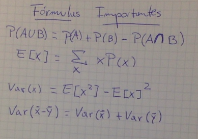

#Week 2

##Variance
The variance is the square root of the standard deviation.


In the case of the flip of a coin, the variance is such that:

 V(x) = p(1 - p), where P is the probability of one of the faces of the coin
 
 ###Sample variance
 
 The sample variance:
 
 - Has an associate population distribution
 - Its expected value is the same value of the variance of the population it is trying to estimate.
 
 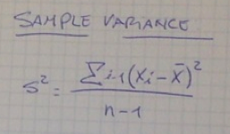

**As you collect more and more data, the distribution of the sample will be more concentrated around the population variance it is trying to estimate.**

And the square root of the sample variance is the **sample standard deviation.**

##The Simulation Experiment

As I get more and more data, the sample distribution will be more concentrated around the variance of the population that the sample is trying to estimate:

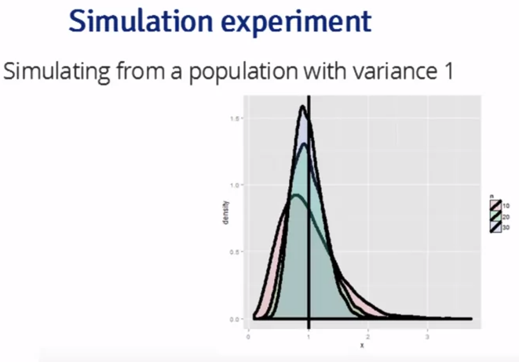

In a simulation what I do is to repeat the experiment as many times as the sample I am selecting and calculate the variance of that repetition experiment. Then what I do is to repeat this set of repetitions many, many times (like thousands of times) and calculate each time the variance of the sample and I get a distribution that is concentrated around the variance of the total population. The larger the sample (the higher the number of repetitions per experiment) the more concentrated is the experiment distribution around the variance of the population.

The following example is the repetition thousand of times of the experiment of roll 10 dices, 20 dices and 30 dices. The distributions in the picture are the distribution of the variance of each repetition of 10, 20 and 30 samples (die rolls). Look that the higher the number of repetitions the more concentrated is the distribution of the resulting experiment:

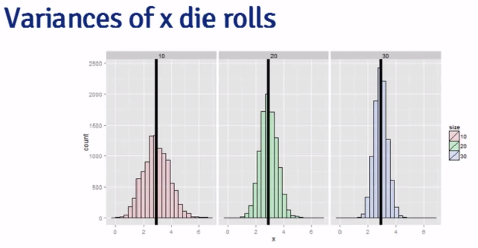

##Simulation Experiments with the Mean

Remember that the average (the mean) of a sample of variables is also a random variable with its own distribution. The sample mean is the same of the mean of the original population:

        E[^X] = u   (^X is the sample of the population, u is the mean of the total population)
        
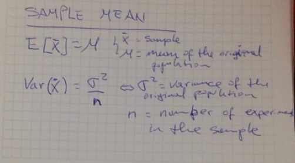

**So, the square root of the variance is the standard deviation. We call it the standard error.**

###Summary

1) The sample variance S^2, estimates the population variance (sigma sq)
2) The distribution of the sample variance S^2 is centered around sigma sq (the variance of the population)
3) The variance of sample mean is variance of the population devided by n, where n is the number of repetition of the experiment
4) So the variance of the sample mean is = sigma sq/n
5) From 4, we can deduct that the logical esptimate of the variance of the sample mean is S^2/n
6) And the logical estimate of the standard error is S/sq root of n

###Conclusions

- The sample variance estimates the population variance
- The distribution of the sample variance is centered at what it is estimating
- It gets more concentrated around what it is estimating as one collects more data (more repetitions per experiment)
- The variance of the sample mean is equal to the population variance devided by n, where n is the number of repetitions per experiment

##Binomial Distribution

###Bernoulli Distribution
The Bernoulli distribution arises as the result of a binary outcome, i.e, the flip of a coin, where p is the probability of one of the faces of the coin:

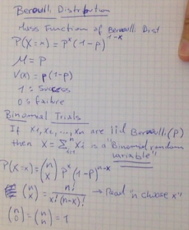

Where (n x)  reads "n choose x", counts the number of ways of selecting x items out of n without replacement disregarding the order of the items.

###Example of a binomial distribution
Imagine a couple that has 8 children, 7 out of which are girls and none are twins. If the probability of give birth a boy or a girl is 0.5 (p = 0.5), then the probability of have 7 girls out of 8 children is the following:

        (8 7)*0.5^7(1-0.5)^(8-7) + (8 8)*0.5^8(1 - 0.5)^(8 - 8)
        
In R, this is the code:

```r
choose(8,7)*0.5^7*(1-0.5)^(8-7) + choose(8,8)*.5^8
```

```
## [1] 0.03515625
```

```r
#Also there is a binomial probability function built in in R pbinom#
pbinom(6, size=8, prob=0.5, lower.tail = FALSE)
```

```
## [1] 0.03515625
```

##The Normal Distribution

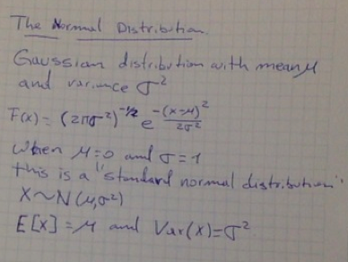

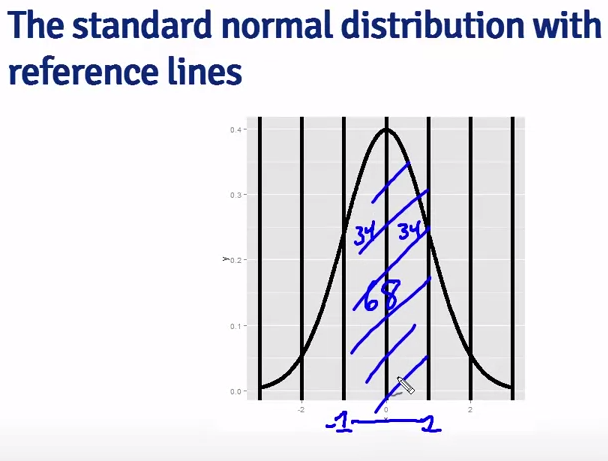

In any normal distribution, the area below the density curve between one and minus one standard deviation covers about 68% of the distribution.

Then the area between -2 and +2 standard deviation is about 95% of the density:

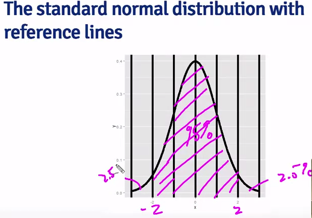

And then, the area between -3 and +3 sd is about 99% of the density:


##How to Convert the Normal Distribution to Standard Nomal Distribution and viceversa

If we have X that is a Nomal Distribution, then we can convert it to the Standard Normal Distribution (we call it Z) the following way:

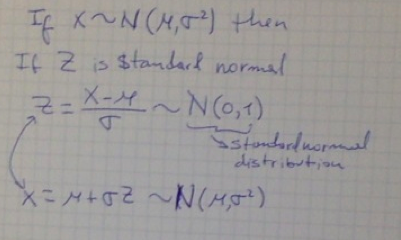

So, 68%, 95%, and 99% of a nomal density lies within 1, 2 and 3 standard deviations from the mean respectively.

Similary, we should remember the following percentiles of the normal distribution:

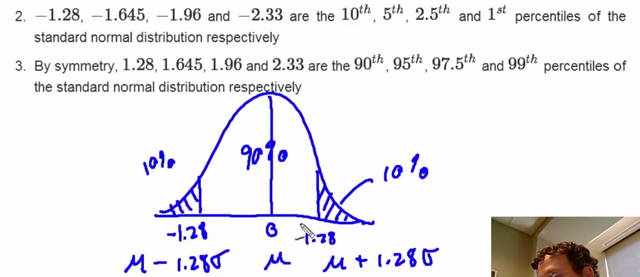

**In general, a typical calculation to remember is:**

What is the probability that a N(u, sigma2) RV is larger than x?

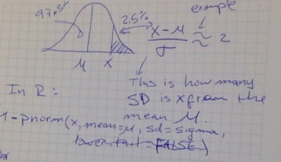

